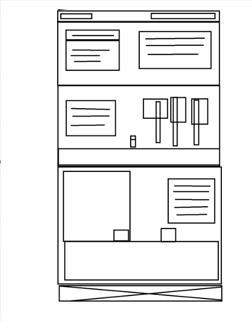

# Terraria - Línea de pasos a seguir

## Requerimientos funcionales

- Se desea una pagina que permita a los nuevos jugadores de Terraria poder adaptarse de mejor manera a la línea de progresion del videojuego, esto con el fin de mejorar su experiencia a la hora de adentrase en este nuevo mundo.

- Se desea presentar al inicio de una seccion hero de la pagina un video de presentacion difuminado con nombre de terraria con lo que es el juego y al lado una explicación de la pagina para que se vea un poco sobre lo que es el juego.

- la linea de progresion será paso a paso desde eel inicio hasta endgame por todo como conseguir las cosas tips y recomendaciones ademas de las clases del juego 

- Para la linea de progresion se piensa colocar la informacion de cada jefe en forma de cartas, para que el usuario al hacer click pueda obtener mas informacion sobre detalles del jefe, link de como poder vencer o estrategias.

- dentro de las cartas de cada jefe se quiere que se presenten mas cartas en las que el usuario pueda seleccionar las distintas clases del videojuego para obtener recomendaciones generales de las build.

- Se que el usuario pueda navegar a travez del contenido por medio de una arquitectura vertizonal mixta incluyendo el inicio para que se regrese y las fases de los diferentes del juego y devolverse tambien por jefe.

- Se tiene en mente que el diseño de la página sea de tipo por ecenas representando el mundo del videojuego, implementando un **scroll dinámico de avance en el juego** estilo como en la página de [GTA VI](https://www.rockstargames.com/VI), utilizando **plugins de** [GSAP](https://gsap.com/scroll/) para crear transiciones fluidas.

- Se desea que el footer sea como la ecena final del juego presentando a a los creadores del juego como la escena final del juego con fotos en degradado con el personaje base de terraria.

## Requirimientos no funcionales 
-Accesibilidad: Tiempo de carga < 3 segundos
-Usabilidad: Interfaz intuitiva, accesibilidad web
-Compatibilidad: Navegadores modernos, dispositivos móviles
-SEO: Meta tags, estructura semántica, URLs amigables
-Seguridad: HTTPS, validación de datos

## Primer bosquejo de la web (wireframe)

